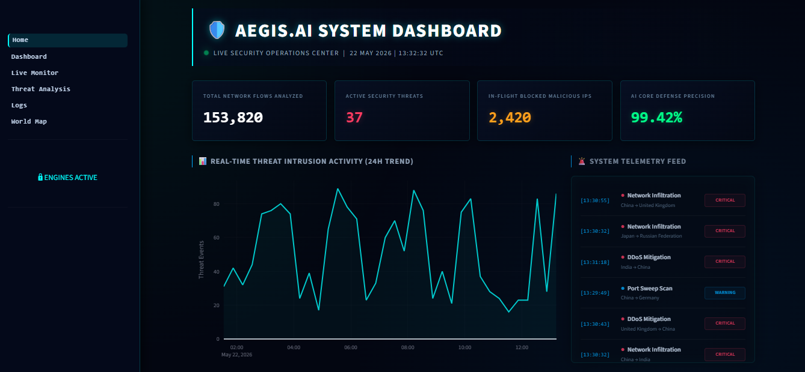

<div align="center">

# 🛡️ AegisAI IDS

### AI-Powered Intrusion Detection System


**AegisAI** is a hybrid, AI-powered Intrusion Detection System that combines machine learning classification with rule-based analysis to detect and visualize network intrusions in real time.

[🚀 Live Demo][Insert Link Here] · [📖 API Docs][Insert Link Here] · [📊 Documentation][Insert Link Here]

---



</div>

---

## 📋 Table of Contents

- [Overview](#-overview)
- [Key Features](#-key-features)
- [System Architecture](#-system-architecture)
- [Tech Stack](#-tech-stack)
- [Core Dependencies](#-core-dependencies)
- [Project Structure](#-project-structure)
- [Installation & Setup](#-installation--setup)
- [Docker Deployment](#-docker-deployment)
- [Usage](#-usage)
- [API Reference](#-api-reference)
- [ML Pipeline](#-ml-pipeline)
- [Dataset](#-dataset)
- [Deployment](#-deployment)
- [Contributing](#-contributing)
- [License](#-license)

---

## 🔍 Overview

Traditional intrusion detection systems rely on static signature databases that fail against novel or evolving attacks. **AegisAI** addresses this gap with a hybrid detection engine:

- A **machine learning layer** trained on the NSL-KDD benchmark dataset (41 network flow features) classifies traffic as normal or malicious with high precision.
- A **rule-based layer** applies expert-defined thresholds for explainable, auditable decisions.
- A **real-time SOC dashboard** visualizes live threat telemetry, attack vectors, geographic threat origins, and historical trends — all in a cyberpunk-themed Security Operations Center UI.

The system is designed as a realistic cybersecurity portfolio project, fully containerized, and deployable to Render or any cloud platform.

---

## ✨ Key Features

| Feature | Description |
|---|---|
| 🤖 **AI Detection Engine** | Logistic Regression pipeline trained on NSL-KDD with StandardScaler preprocessing |
| 📊 **SOC Dashboard** | Real-time multi-page Streamlit UI with auto-refresh every 3 seconds |
| 🌍 **Global Threat Map** | Interactive 3D globe (PyDeck) showing live attack arcs by country |
| 📈 **Threat Analytics** | Historical timelines, distribution matrices, and hourly heatmaps |
| 📜 **Audit Logging** | Persistent CSV audit trail of all prediction events with timestamps |
| 🔄 **Model Registry** | Versioned model persistence (`ids_model_v1.pkl` → `ids_model_vN.pkl`) with experiment tracking |
| 🐳 **Containerized** | Full Docker + docker-compose setup for one-command local deployment |
| ☁️ **Cloud Ready** | Render deployment configuration included (`render.yam`) |
| ⚡ **REST API** | FastAPI backend with health check, prediction, and CORS endpoints |
| 🔁 **Hybrid IDS Logic** | Rule-based detector (`rule_based.py`) alongside ML for explainability comparison |

---

## 🏗️ System Architecture

```
┌─────────────────────────────────────────────────────────────────┐
│                     AegisAI IDS Platform                        │
│                                                                 │
│  ┌──────────────────────────────────────────────────────────┐   │
│  │              Streamlit Frontend (Port 8501)              │   │
│  │  ┌──────────┐ ┌───────────┐ ┌──────────┐ ┌──────────┐  │   │
│  │  │  Home /  │ │ Dashboard │ │  Threat  │ │  World   │  │   │
│  │  │   SOC    │ │  Metrics  │ │ Analysis │ │   Map    │  │   │
│  │  └────┬─────┘ └─────┬─────┘ └────┬─────┘ └────┬─────┘  │   │
│  │       └─────────────┴────────────┴─────────────┘        │   │
│  │                    utils/api.py                          │   │
│  └────────────────────────┬─────────────────────────────────┘   │
│                           │ HTTP (REST)                         │
│  ┌────────────────────────▼─────────────────────────────────┐   │
│  │              FastAPI Backend (Port 8000)                  │   │
│  │   GET /health    GET /predict    GET /                    │   │
│  │              alert_logic.py · schemas.py                  │   │
│  └────────────────────────┬─────────────────────────────────┘   │
│                           │                                     │
│  ┌────────────────────────▼─────────────────────────────────┐   │
│  │                    ML Pipeline                            │   │
│  │  preprocess_nslkdd.py → feature_engineering.py           │   │
│  │  train_model.py → model_registry.py → models/*.pkl       │   │
│  │  evaluate_model.py · validate.py · compare.py            │   │
│  └────────────────────────┬─────────────────────────────────┘   │
│                           │                                     │
│  ┌────────────────────────▼─────────────────────────────────┐   │
│  │                     Data Layer                            │   │
│  │  data/nslkdd/KDDTrain+.txt  ·  data/processed_nslkdd.csv │   │
│  │  models/experiments.csv     ·  logs/audit.csv            │   │
│  └──────────────────────────────────────────────────────────┘   │
└─────────────────────────────────────────────────────────────────┘
```

---

## 🛠️ Tech Stack

| Layer | Technology |
|---|---|
| **Language** | Python 3.11.9 |
| **Backend API** | FastAPI 0.128.0, Uvicorn 0.40.0 |
| **Frontend** | Streamlit 1.57.0, streamlit-autorefresh 1.0.1 |
| **Machine Learning** | scikit-learn 1.8.0, joblib 1.5.3 |
| **Data Processing** | pandas 2.3.3, NumPy 2.4.0 |
| **Visualization** | Plotly 6.7.0, PyDeck 0.9.2, Matplotlib 3.10.8 |
| **Validation** | Pydantic 2.12.5 |
| **Configuration** | python-dotenv 1.2.2 |
| **Containerization** | Docker, Docker Compose |
| **Deployment** | Render (cloud), Docker (self-hosted) |
| **Dataset** | NSL-KDD (41-feature benchmark IDS dataset) |

---

## 📦 Core Dependencies

These are the primary packages the system depends on. Full pinned versions are in `requirements.txt`.

```
# API & Server
fastapi==0.128.0
uvicorn==0.40.0
pydantic==2.12.5
python-multipart==0.0.28

# Frontend
streamlit==1.57.0
streamlit-autorefresh==1.0.1
plotly==6.7.0
pydeck==0.9.2

# Machine Learning
scikit-learn==1.8.0
joblib==1.5.3
scipy==1.16.3

# Data
pandas==2.3.3
numpy==2.4.0
matplotlib==3.10.8

# Utilities
python-dotenv==1.2.2
requests==2.34.0
```

---

## 📁 Project Structure

```
aegisai-ids/
│
├── 📂 frontend/                  # Streamlit multi-page dashboard
│   ├── Home.py                   # SOC home screen with live telemetry
│   ├── app.py                    # Legacy entry point
│   ├── pages/
│   │   ├── 1_Dashboard.py        # KPI metrics, packet simulation, SIEM feed
│   │   ├── 2_Live_Monitor.py     # Real-time threat monitor with autorefresh
│   │   ├── 3_Threat_Analysis.py  # Charts, heatmaps, top attackers
│   │   ├── 4_Logs.py             # Security event log table
│   │   └── 5_World_Map.py        # Interactive 3D global attack map
│   └── utils/
│       ├── api.py                # FastAPI client (health check + predict)
│       ├── data_generator.py     # Simulated network event generator
│       └── styles.py             # Shared CSS theme loader
│
├── 📂 src/                       # Backend API and ML pipeline
│   ├── app.py                    # FastAPI application
│   ├── alert_logic.py            # Severity classification logic
│   ├── schema.py / schemas.py    # Pydantic request/response models
│   ├── feature_engineering.py    # Feature extraction from network data
│   ├── train_model.py            # Training pipeline with class balancing
│   ├── evaluate_model.py         # Evaluation with classification report
│   ├── validate.py               # Confusion matrix generation
│   ├── preprocess_nslkdd.py      # NSL-KDD dataset preprocessor
│   ├── model_registry.py         # Versioned model save/load system
│   ├── model_utils.py            # Model I/O helpers
│   ├── rule_based.py             # Explainable rule-based detector
│   ├── compare.py                # ML vs rule-based comparison
│   └── hyperparameter_tuning.py  # GridSearchCV tuning pipeline
│
├── 📂 data/
│   ├── nslkdd/                   # Raw NSL-KDD dataset files
│   ├── processed_nslkdd.csv      # Preprocessed training data
│   └── processed_data.csv        # Synthetic sample data
│
├── 📂 models/
│   ├── ids_model.pkl             # Latest active model (symlink)
│   ├── ids_model_v1.pkl → vN.pkl # Versioned model artifacts
│   └── experiments.csv           # Training run metadata log
│
├── 📂 logs/
│   └── audit.csv                 # Prediction audit trail
│
├── 📂 docs/                      # Architecture and dataset documentation
├── 📂 .streamlit/
│   └── config.toml               # Streamlit theme (dark cyberpunk)
│
├── Dockerfile                    # API container
├── Dockerfile.frontend           # Dashboard container
├── docker-compose.yml            # Multi-service orchestration
├── requirements.txt              # Pinned Python dependencies
├── runtime.txt                   # Python version specification
└── render.yam                    # Render cloud deployment config
```

---

## ⚙️ Installation & Setup

### Prerequisites

- Python **3.11.9** (see `runtime.txt`)
- `pip` package manager
- Git

### Step 1 — Clone the repository

```bash
git clone https://github.com/your-username/aegisai-ids.git
cd aegisai-ids
```

### Step 2 — Create and activate a virtual environment

```bash
# Create virtual environment
python -m venv venv

# Activate — macOS/Linux
source venv/bin/activate

# Activate — Windows
venv\Scripts\activate
```

### Step 3 — Install dependencies

```bash
pip install -r requirements.txt
```

### Step 4 — Configure environment variables

Create a `.env` file in the project root:

```bash
cp .env.example .env   # if provided, otherwise create manually
```

```env
# .env
AEGISAI_API_URL=http://127.0.0.1:8000
AEGISAI_API_KEY=your-secret-key-here
LOG_LEVEL=INFO
```

> ⚠️ Never commit your `.env` file. It is already listed in `.gitignore`.

### Step 5 — Prepare the dataset and train the model

The NSL-KDD dataset is included in `data/nslkdd/`. Preprocess and train:

```bash
# Preprocess NSL-KDD into a clean feature matrix
python src/preprocess_nslkdd.py

# Train the intrusion detection model
python src/train_model.py

# Evaluate model performance
python src/evaluate_model.py

# (Optional) Generate confusion matrix image
python src/validate.py
```

Expected output after training:

```
Dataset loaded: (125973, 42)
Class counts before balancing: {0: 67343, 1: 58630}  (ratio=1.15)
Classes reasonably balanced — no oversampling.
Training model on features: ['duration', 'protocol_type', ...]
Model saved: version=8, path=models/ids_model_v8.pkl
```

### Step 6 — Start the backend API

```bash
uvicorn src.app:app --host 0.0.0.0 --port 8000 --reload
```

Verify it is running:

```bash
curl http://localhost:8000/health
# {"backend":"online","model_status":"active","timestamp":"2026-05-21 10:00:00"}
```

### Step 7 — Start the Streamlit dashboard

Open a **second terminal** (with the virtual environment activated):

```bash
streamlit run frontend/Home.py --server.port 8501
```

Navigate to **http://localhost:8501** in your browser.

---

## 🐳 Docker Deployment

Docker Compose starts both the API and dashboard as separate containers with a single command.

### Build and start all services

```bash
docker compose up --build
```

This starts:

| Service | Container | Port |
|---|---|---|
| FastAPI backend | `aegisai_api` | `8000` |
| Streamlit dashboard | `aegisai_dashboard` | `8501` |

### Access the running platform

- **SOC Dashboard:** http://localhost:8501
- **API Health Check:** http://localhost:8000/health
- **API Interactive Docs:** http://localhost:8000/docs

### Environment variables for Docker

Pass your API key and log level via a `.env` file at the project root — Docker Compose reads it automatically:

```env
AEGISAI_API_KEY=your-secret-key-here
LOG_LEVEL=INFO
```

### Stop the services

```bash
docker compose down
```

### Rebuild after code changes

```bash
docker compose up --build --force-recreate
```

### Individual container build (advanced)

```bash
# Build and run only the API
docker build -t aegisai-api .
docker run -p 8000:8000 aegisai-api

# Build and run only the dashboard
docker build -t aegisai-dashboard -f Dockerfile.frontend .
docker run -p 8501:8501 -e AEGISAI_API_URL=http://host.docker.internal:8000 aegisai-dashboard
```

---

## 🚀 Usage

### SOC Dashboard Walkthrough

Navigate using the left sidebar across five modules:

**🏠 Home — System Dashboard**
- Live telemetry counter cards (flows analyzed, active threats, blocked IPs, AI precision)
- 24-hour threat intrusion activity chart (Plotly time series)
- Real-time system telemetry feed with severity-coded events
- Platform module launcher grid

**📊 Dashboard — IDS Command Center**
- KPI metrics with auto-refresh every 3 seconds
- Click **"Run Security Scan"** to send a test packet to the API and view the AI prediction
- Click **"Generate Security Event"** or **"Generate Critical Event"** to populate the SIEM log
- Filter and view **Critical Threats Only** from the log table
- Severity distribution bar chart

**📡 Live Monitor**
- Continuously streams packets through the AI engine every 3 seconds
- Displays the latest packet fields, AI prediction, and threat status

**🧠 Threat Analysis**
- Historical attack vector timeline (line chart)
- Threat distribution matrix (pie + bar charts)
- Hourly attack density heatmap (day-of-week × hour)
- Top 10 attacker reconnaissance table

**🌍 Global Attack Map**
- Full-screen 3D globe (PyDeck GlobeView)
- Column layers showing threat density by country
- Arc layers showing attack origin → destination flows
- Zoom (`＋`/`－`) and rotation (`🌐`) controls
- Live bottom-HUD telemetry counters

---

### Running the ML pipeline from the CLI

```bash
# Preprocess raw NSL-KDD data
python src/preprocess_nslkdd.py

# Train a new model version
python src/train_model.py

# Evaluate the latest model
python src/evaluate_model.py

# Generate confusion matrix (saved to models/confusion_matrix.png)
python src/validate.py

# Compare ML model vs rule-based detector
python src/compare.py

# Run hyperparameter tuning (GridSearchCV)
python src/hyperparameter_tuning.py
```

### Simulating a prediction from Python

```python
import requests

response = requests.get("http://localhost:8000/predict")
result = response.json()

print(result)
# {
#   "prediction": "DDoS",
#   "severity": "Critical",
#   "confidence": 95.7,
#   "blocked": True,
#   "timestamp": "10:45:23"
# }
```

### Checking alert severity logic directly

```python
from src.alert_logic import generate_alert

alert = generate_alert(
    prediction="attack",
    features={"src_bytes": 5000, "count": 450}
)

print(alert)
# {
#   "prediction": "attack",
#   "severity": "critical",
#   "alert": True,
#   "message": "THREAT DETECTED | Severity: CRITICAL"
# }
```

---

## 📡 API Reference

The FastAPI backend exposes the following endpoints. Interactive documentation is available at `/docs` (Swagger UI) and `/redoc`.

### `GET /`

Root health ping.

```bash
curl http://localhost:8000/
```

```json
{
  "message": "AegisAI IDS Backend Running",
  "status": "online"
}
```

---

### `GET /health`

Detailed backend health status.

```bash
curl http://localhost:8000/health
```

```json
{
  "backend": "online",
  "model_status": "active",
  "timestamp": "2026-05-21 10:00:00"
}
```

---

### `GET /predict`

Returns an AI-generated threat classification for a simulated network flow.

```bash
curl http://localhost:8000/predict
```

```json
{
  "prediction": "Brute Force",
  "severity": "High",
  "confidence": 93.41,
  "blocked": false,
  "timestamp": "10:45:23"
}
```

**Possible prediction values:**

| Prediction | Severity |
|---|---|
| `Benign` | Low |
| `Port Scan` | Medium |
| `Brute Force` | High |
| `Web Attack` | High |
| `DDoS` | Critical |
| `Botnet` | Critical |
| `Infiltration` | Critical |

---

## 🧠 ML Pipeline

AegisAI uses a **scikit-learn Pipeline** combining feature scaling and classification:

```
Raw NSL-KDD CSV
      │
      ▼
preprocess_nslkdd.py
  • 41 features extracted
  • LabelEncoding: protocol_type, service, flag
  • Binary label: normal=0, attack=1
  • Duplicate removal
      │
      ▼
feature_engineering.py
  • Passes all non-label columns as features to the model
      │
      ▼
train_model.py
  • Class imbalance check (oversampling if ratio > 1.5 on small datasets)
  • Pipeline: StandardScaler → LogisticRegression (class_weight="balanced")
  • Versioned save via model_registry.py
      │
      ▼
models/ids_model_vN.pkl  ←──  models/ids_model.pkl (latest)
      │
      ▼
evaluate_model.py / validate.py
  • Accuracy, Precision, Recall, F1-score
  • Confusion matrix image (models/confusion_matrix.png)
```

### Model versioning

Every training run saves a numbered artifact and appends a metadata row to `models/experiments.csv`:

```csv
version,filename,saved_at,notes,train_accuracy
7,ids_model_v7.pkl,2026-01-28T16:24:09,Day 19 training,1.0
8,ids_model_v8.pkl,2026-05-21T10:00:00,NSL-KDD full training,0.97
```

### Rule-based comparison

`src/compare.py` benchmarks the ML model against a hand-crafted rule-based detector:

```bash
python src/compare.py
```

```
=== ML Model Results ===
Accuracy: 0.964
              precision  recall  f1-score
           0       0.97    0.96      0.96
           1       0.96    0.97      0.96

=== Rule-based Results ===
Accuracy: 0.731
Agreement: 119/125 packets
```

---

## 📊 Dataset

AegisAI uses the **NSL-KDD** dataset — the most widely cited benchmark for intrusion detection research.

| Property | Value |
|---|---|
| **Training samples** | 125,973 flows |
| **Test samples (KDDTest+)** | 22,544 flows |
| **Features** | 41 network connection attributes |
| **Classes** | Normal (0) · Attack (1) |
| **Attack categories** | DoS, Probe, R2L, U2R |

The raw data lives in `data/nslkdd/`. To re-download from Kaggle:

```bash
pip install kaggle
kaggle datasets download -d hassan06/nslkdd -p data/nslkdd --unzip
```

Key features used by the model include: `duration`, `protocol_type`, `service`, `flag`, `src_bytes`, `dst_bytes`, `count`, `serror_rate`, `rerror_rate`, `same_srv_rate`, and 31 additional connection-level attributes.

---

## ☁️ Deployment

### Render (Cloud)

AegisAI includes a Render deployment configuration (`render.yam`). To deploy the Streamlit dashboard to Render:

1. Push your repository to GitHub.
2. Go to [render.com](https://render.com) → **New Web Service**.
3. Connect your GitHub repository.
4. Render will auto-detect the `render.yam` config:
   - **Build command:** `pip install -r requirements.txt`
   - **Start command:** `streamlit run frontend/Home.py --server.port=10000 --server.address=0.0.0.0`
5. Add environment variables in the Render dashboard:
   - `AEGISAI_API_URL` → your deployed FastAPI URL
   - `AEGISAI_API_KEY` → your secret key
6. Deploy.

**Live Demo:** [Insert Link Here]

**API Documentation:** [Insert Link Here]

---

## 🤝 Contributing

Contributions, bug reports, and feature suggestions are welcome.

1. **Fork** the repository.
2. Create a feature branch: `git checkout -b feature/your-feature-name`
3. Make your changes and commit: `git commit -m "feat: add your feature"`
4. Push to your branch: `git push origin feature/your-feature-name`
5. Open a **Pull Request** against `main`.

### Commit message convention

```
feat:     New feature
fix:      Bug fix
docs:     Documentation only
refactor: Code restructure (no feature/fix)
test:     Adding or updating tests
chore:    Build, config, or tooling changes
```

---

## 📄 License

This project is licensed under the **MIT License** — see the [LICENSE](LICENSE) file for details.

```
MIT License · Copyright (c) 2026 VIKASH KUMAR JHA
```

---

<div align="center">

Built ❤️ · AegisAI IDS

⭐ Star this repo if you found it useful!

</div>
